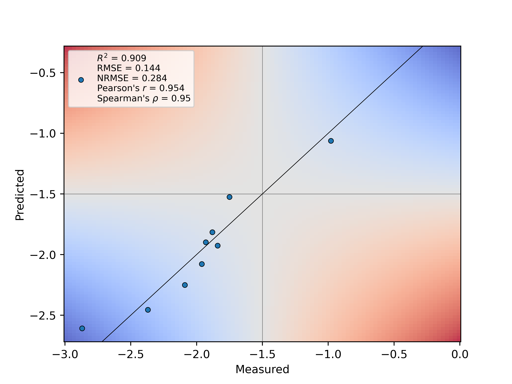

This repository contains supplementary information to

Niklas E. Siedhoff<sup>*1,§*</sup>, Alexander-Maurice Illig<sup>*1,§*</sup>, Ulrich Schwaneberg<sup>*1,2*</sup>, Mehdi D. Davari<sup>*1,\**</sup>, <br>
PyPEF – An Integrated Framework for Data-Driven Protein Engineering, *J. Chem. Inf. Model.* 2021, 61, 3463-3476 <br>
https://doi.org/10.1021/acs.jcim.1c00099 <br>
<sup>*1*</sup><sub>Institute of Biotechnology, RWTH Aachen University, Worringer Weg 3, 52074 Aachen, Germany</sub> <br>
<sup>*2*</sup><sub>DWI-Leibniz Institute for Interactive Materials, Forckenbeckstraße 50, 52074 Aachen, Germany</sub> <br>
<sup>*\**</sup><sub>Corresponding author</sub> <br>
<sup>*§*</sup><sub>Equal contribution</sub> <br>


# PyPEF: Pythonic Protein Engineering Framework

a framework written in Python 3 for performing sequence-based machine learning-assisted protein engineering.


Protein engineering by rational or random approaches generates data that can aid the construction of self-learned sequence-function landscapes to predict beneficial variants by using probabilistic methods that can screen the unexplored sequence space with uncertainty *in silico*. Such predictive methods can be applied for increasing the success/effectivity of an engineering campaign while partly offering the prospect to reveal (higher-order) epistatic effects. Here we present an engineering framework termed PyPEF for assisting the tuning and validation of models for combination of identified substitutions using machine learning algorithms (partial least squares (PLS), support vector machines (SVR), random forest (RF), and multilayer perceptron (MLP)-based regression) from the [scikit-learn](https://github.com/scikit-learn/scikit-learn) package. As training input, the developed software tool requires the sequence and the corresponding screening results (fitness labels) of the identified variants as CSV (or FASTA-like datasets following a self-defined convention). Using PLS, SVR, RF, or MLP regression, PyPEF trains on the given learning data while optimizing model hyperparameters and validates model performances on left-out data. Finally, the selected or best model for validation can be used to perform directed evolution walks *in silico* (see [Church-lab implementation](https://github.com/churchlab/UniRep) or the [reimplementation](https://github.com/ivanjayapurna/low-n-protein-engineering)) or to predict natural diverse or recombinant sequences that subsequently are to be designed and validated in the wet-lab.

For detailed information, please refer to the above-mentioned publication and related Supporting Information.

The workflow procedure is explained in the [Jupyter notebook](/workflow/Workflow_PyPEF.ipynb) (.ipynb) protocol (see
Tutorial section below and the ./workflow directory).  

## Running example
PyPEF was developed to be run using a command-line interface:  
```
python3 run_pypef.py --help
python3 run_pypef.py mklsvs -w WT_SEQUENCE.FASTA -i VARIANT-FITNESS_DATA.CSV 
python3 run_pypef.py run -l LEARNING_SET.FASTA -v VALIDATION_SET.FASTA --regressor TYPE 
python3 run_pypef.py --show
python3 run_pypef.py run -m MODEL12345 -f VALIDATION_SET.FASTA
python3 run_pypef.py run -m MODEL12345 -p PREDICTION_SET.FASTA
python3 run_pypef.py mkps -w WT_SEQUENCE.FASTA -i VARIANT-FITNESS_DATA.CSV --drecomb
python3 run_pypef.py run -m MODEL12345 --pmult --drecomb
python3 run_pypef.py directevo -m MODEL12345 --ywt WT_FITNESS -w WT_SEQUENCE.FASTA --usecsv -i VARIANT-FITNESS_DATA.CSV
```
PyPEF's package dependencies are linked [here](https://github.com/Protein-Engineering-Framework/PyPEF/network/dependencies). A small API for sequence encoding and model validation is provided in the [encoding_validation_api](/encoding_validation_api) directory.
Further, for designing your own API based on the PyPEF workflow, modules can be adapted from the source code provided in the [pypef source](/pypef) directory.
A quick installation of the PyPEF command line framework using PyPI (only for Linux OS) can be performed with:
```
pip install pypef
```
After successful installation, PyPEF should work by calling `pypef` in the shell, e.g.:
```
pypef --help
```
The detailed routine for setting up a new virtual environment using Anaconda, installing required Python packages for that environment, and running the Jupyter Notebook tutorial is given below.

## Tutorial

Before starting running the tutorial, it is a good idea to set-up a new Python environment using Anaconda, https://www.anaconda.com/, e.g. using [Anaconda](https://www.anaconda.com/products/individual) ([Anaconda3-2020.11-Linux-x86_64.sh installer download](https://repo.anaconda.com/archive/Anaconda3-2020.11-Linux-x86_64.sh)) or [Miniconda](https://docs.conda.io/en/latest/miniconda.html).
Change to the download directory and run the installation, e.g. in Linux:

```
bash Anaconda3-2020.11-Linux-x86_64.sh
```

After accepting all steps, the conda setup should also be written to your `~/.bashrc`file, so that you can call anaconda typing `conda`.
Next, to download this repository click Code > Download ZIP and unzip the zipped file, e.g. with `unzip PyPEF-main.zip`, or just clone this repository using your bash shell to your local machine `git clone https://github.com/Protein-Engineering-Framework/PyPEF`.
To setup a new environment with conda you can either create the conda environment from the provided YAML file inside the PyPEF directory (`cd PyPEF` or `cd PyPEF-main` dependent on the downloaded file name):

```
conda env create --file pypef_environment.yml
```

or you can create a new environment yourself. You just need to specify the name of the environment and the Python version, e.g.:

```
conda create --name pypef python=3.7
```

To activate the environment you can define:

```
conda activate pypef
```

After activating the environment you can install required packages after changing the directory to the PyPEF directory (`cd PyPEF` or `cd PyPEF-main`) and install required packages with pip if you did not use the YAML file for creating the environment (when using conda packages will be installed in anaconda3/envs/pypef/lib/python3.7/site-packages):

```
python3 -m pip install -r requirements.txt
```

and optionally:

```
python3 -m pip install -r requirements_parallelization.txt
```

Now, after installing required packages, you should be able to directly run pypef in your preferred command-line interface (see running example).

To run the tutorial after installing required packages either from the YAML environment file or the TEXT file(s), you have to open a Jupyter Notebook. If you have installed Anaconda, Jupyter Notebook and other commonly used packages for scientific computing and data science should be already installed in Python. If not, you can also install Jupyter via `conda install ipython jupyter`. To use the pypef environment as kernel inside the Jupyter Notebook, you need to install the ipykernel:

```
conda install -c anaconda ipykernel
python3 -m ipykernel install --user --name=pypef
```

Now change the directory to ./workflow (`cd workflow`) and run the .ipynb file:

```
jupyter notebook
```

Copy the notebook URL in your internet browser and select the Workflow_PyPEF.ipynb file to open it. Now you can select the pypef Python environment at the top Notebook menu: Kernel > Change kernel > pypef (otherwise you would use your default Python version as environment, i.e. you would have to install the required packages for this interpreter as well; for this case the installation of the prerequisite packages can also be done within the notebook in provided code fields). 

Good luck and have fun!
