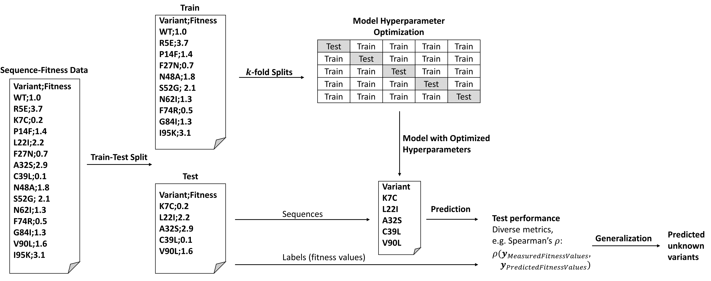

This repository contains the source files and supplementary information for the PyPEF framework, which is described in<br>

Niklas E. Siedhoff<sup>*1,§*</sup>, Alexander-Maurice Illig<sup>*1,§*</sup>, Ulrich Schwaneberg<sup>*1,2*</sup>, Mehdi D. Davari<sup>*3,\**</sup>, <br>
PyPEF – An Integrated Framework for Data-Driven Protein Engineering, *J. Chem. Inf. Model.* 2021, 61, 3463-3476 <br>
https://doi.org/10.1021/acs.jcim.1c00099 <br>

as well as additional framework features described in the preprint<br>

Alexander-Maurice Illig<sup>*1,§*</sup>, Niklas E. Siedhoff<sup>*1,§*</sup>, Ulrich Schwaneberg<sup>*1,2*</sup>, Mehdi D. Davari<sup>*3,\**</sup>, <br>
A hybrid model combining evolutionary probability and machine learning leverages data-driven protein engineering, *To be published*<br>
Preprint available at bioRxiv: https://doi.org/10.1101/2022.06.07.495081.

<sup>*1*</sup><sub>Institute of Biotechnology, RWTH Aachen University, Worringer Weg 3, 52074 Aachen, Germany</sub> <br>
<sup>*2*</sup><sub>DWI-Leibniz Institute for Interactive Materials, Forckenbeckstraße 50, 52074 Aachen, Germany</sub> <br>
<sup>*3*</sup><sub>Department of Bioorganic Chemistry, Leibniz Institute of Plant Biochemistry, Weinberg 3, 06120 Halle, Germany</sub> <br>
<sup>*\**</sup><sub>Corresponding author</sub> <br>
<sup>*§*</sup><sub>Equal contribution</sub> <br>

---
## Table of Contents
- [PyPEF](#pypef)
- [Installation](#installation)
- [Requirements](#requirements)
- [Running Examples](#examples)
- [Tutorial](#tutorial)
- [Encoding Technique Options](#encoding-options)
- [Modeling Techniques](#modeling-techniques)
    - [Pure Machine Learning (ML)-based Modeling](#pure-ml)
    - [Hybrid Modeling](#hybrid-modeling)
- [Model Hyperparameter Grids for Training](#grids)
- [Setting Up the Scripts Yourself](#set-up)
- [Preprocessing for DCA-based Sequence Encoding](#dca-preprocessing)
- [API Usage for Sequence Encoding](#api-usage)
---

<a name="pypef"></a>
# PyPEF: Pythonic Protein Engineering Framework
[](https://pypi.org/project/pypef/)
[](https://www.python.org/downloads/)

a framework written in Python 3 for performing sequence-based machine learning-assisted protein engineering to predict a protein's fitness from its sequence using different forms of sequence encoding:
- One-hot encoding
- Amino acid descriptor sets (taken from AAindex database) encoding
- Direct coupling analysis (amino acid coevolution based on multiple sequence alignments) encoding

Written by Niklas Siedhoff and Alexander-Maurice Illig.

<p align="center">
    
</p>

Protein engineering by rational or random approaches generates data that can aid the construction of self-learned sequence-function landscapes to predict beneficial variants by using probabilistic methods that can screen the unexplored sequence space with uncertainty *in silico*. Such predictive methods can be applied for increasing the success/effectivity of an engineering campaign while partly offering the prospect to reveal (higher-order) epistatic effects. Here we present an engineering framework termed PyPEF for assisting the supervised training and testing of regression models for predicting beneficial combinations of (identified) amino acid substitutions using machine learning algorithms from the [Scikit-learn](https://github.com/scikit-learn/scikit-learn) package. As training input, the developed framework requires the variant sequences and the corresponding screening results (fitness labels) of the identified variants as CSV (or FASTA-Like (FASL) datasets following a self-defined convention). Using linear or nonlinear regression methods (partial least squares (PLS), Ridge, Lasso, Elastic net, support vector machines (SVR), random forest (RF), and multilayer perceptron (MLP)-based regression), PyPEF trains on the given learning data while optimizing model hyperparameters (default: five-fold cross-validation) and can compute model performances on left-out test data. As sequences are encoded using amino acid descriptor sets taken from the [AAindex database](https://www.genome.jp/aaindex/), finding the best index-dependent encoding for a specific test set can be seen as a hyperparameter search on the test set. In addition, one-hot and [direct coupling analysis](https://en.wikipedia.org/wiki/Direct_coupling_analysis)-based feature generation are implemented as sequence encoding techniques, which often outperform AAindex-based encoding techniques. Finally, the selected or best identified encoding technique and regression model can be used to perform directed evolution walks *in silico* (see [Church-lab implementation](https://github.com/churchlab/UniRep) or the [reimplementation](https://github.com/ivanjayapurna/low-n-protein-engineering)) or to predict natural diverse or recombinant variant sequences that subsequently are to be designed and validated in the wet-lab.

For detailed information, please refer to the above-mentioned publications and related Supporting Information.

The workflow procedure is explained in the [Jupyter notebook](/workflow/Workflow_PyPEF.ipynb) (.ipynb) protocol (see
Tutorial section below).



<a name="installation"></a>
## Quick Installation
A quick installation of the PyPEF command line framework using PyPI for Linux and Windows for **Python 3.10** can be performed with:

```
pip install -U pypef
```

After successful installation, PyPEF should work by calling `pypef` in the shell:

```
pypef --help
```

The detailed routine for setting up a new virtual environment with Anaconda, installing the necessary Python packages for that environment, and running the Jupyter notebook tutorial can be found below in the Tutorial section.
For Linux users, a quick file setup and CLI run test can be performed running [/workflow/easy_install_test.sh](/workflow/easy_install_test.sh) in Bash (requires conda, i.e. Miniconda3 or Anaconda3).

<a name="requirements"></a>
## Requirements
- Python >=3.9
    - numpy 
    - scipy
    - pandas
    - scikit-learn
    - tensorflow 
    - ray[default]
    - matplotlib
    - tqdm
    - biopython
    - schema
    - docopt
    - adjustText

If errors occur with third-party packages, you can check the required Python version dependencies (if available); also, as a rule of thumb, it is often helpful to use the second most recent Python version instead of the latest, since development for the latest version is often ongoing:

[](https://github.com/numpy/numpy)
[](https://github.com/scipy/scipy)
[](https://github.com/pandas-dev/pandas)
[](https://github.com/scikit-learn/scikit-learn)
[](https://github.com/tensorflow/tensorflow)
[](https://github.com/ray-project/ray)
[](https://github.com/matplotlib/matplotlib)
[](https://github.com/tqdm/tqdm)
[](https://github.com/biopython/biopython)
[](https://github.com/keleshev/schema)
[](https://github.com/docopt/docopt)
[](https://github.com/Phlya/adjustText)


<a name="examples"></a>
## Running Examples
Printing the help function:   
```
pypef --help
```

Creating sets for model learning and testing:
```
pypef mklsts -w WT_SEQUENCE.FASTA -i VARIANT-FITNESS_DATA.CSV 
```

Training and testing a model (encoding technique = {`aaidx`, `onehot`, `dca`}, regression model = {`pls`, `ridge`, `lasso`, `elasticnet`, `svr`, `rf`, `mlp`}):
```
pypef ml -e aaidx -l LEARNING_SET.FASL -t TEST_SET.FASL --regressor pls 
```

Show the model performance(s) (reads and prints the created Model_Results.txt file):
```
pypef ml --show
```

Load a trained model, predict fitness of test sequences using that model, and plot the measured versus the predicted fitness values:
```
pypef ml -e aaidx -m MODEL -t TEST_SET.FASL
```
`-m MODEL`is the saved model Pickle file name, for `-e aaidx` this will be the AAindex to use for encoding, e.g. `-m ARGP820101`, for `-e onehot` it will be `-m ONEHOTMODEL` and for `-e dca` it will be `-m DCAMODEL`.

Load a trained model and use it for predicting the fitness of sequences of a prediction set (with unknown corresponding fitness):
```
pypef ml -e aaidx -m MODEL -p PREDICTION_SET.FASTA
```

Systematic creation of prediction sets – double, triple, or quadruple substituted variant recombinations of already identified amino acid substitutions (`--drecomb`, `--trecomb`, `--qarecomb`, `--qirecomb`) or naturally diverse combinations of all 20 canonical amino acids at the identified positions (`--ddiverse`, `--tdiverse`, `--qdiverse`): 
```
pypef mkps -w WT_SEQUENCE.FASTA -i VARIANT-FITNESS_DATA.CSV --drecomb
```

Systematic prediction of the created (re)combination prediction sets:
```
pypef ml -e aaidx -m MODEL --pmult --drecomb
```

An alternative way of prediction and variant identification is the *in silico* [directed evolution](https://en.wikipedia.org/wiki/Directed_evolution) using the [Metropolis-Hastings](https://en.wikipedia.org/wiki/Metropolis%E2%80%93Hastings_algorithm) algorithm:
```
pypef directevo ml -e -m MODEL -w WT_SEQUENCE.FASTA --usecsv -i VARIANT-FITNESS_DATA.CSV --ywt WT_FITNESS
```

Encoding a variant-fitness CSV file and writing it to a new CSV file (for the different encodings, also specify the AAindex name with the `-m` option next to `-e aaidx`):

```
pypef encode -i VARIANT-FITNESS_DATA.CSV -w WT_SEQUENCE.FASTA -e aaidx
```

Using the created variant-encoded sequence-fitness CSV file for a simulated "low *N*" engineering task:

```
pypef ml low_n -i VARIANT-FITNESS-ENCODING_DATA.CSV --regressor pls
```

Using the created variant-encoded sequence-fitness CSV file for a simulated "mutation extrapolation" task (requires higher/deeply-substituted variants):
```
pypef ml extrapolation -i VARIANT-FITNESS-ENCODING_DATA.CSV --regressor pls
```

The use of the hybrid model (`pypef hybrid`) - instead of a pure ML model (`pypef ml`) as described in the steps above - is quite similar in terms of commands, but does not require the definition of the `-e`/`--encoding` and the `--regressor` flags, since it depends only on the DCA-based encoding technique and (so far) only uses Ridge regression for modeling. However, DCA-based encoding of sequences always requires a parameter file as input, which comes from the preprocessing of a query-specific multiple sequence alignment (MSA) and results in the parameter file generated by [plmc](https://github.com/debbiemarkslab/plmc). E.g. for training a model on a learning set and testing it on a test set, the command for hybrid modeling is:

```
pypef hybrid -l LEARNING_SET.FASL -t TEST_SET.FASL --params PLMC_FILE.params
``` 

Also, it is now possible to infer DCA model parameters using [GREMLIN](https://www.pnas.org/doi/10.1073/pnas.1314045110)'s [TensorFlow implementation](https://github.com/sokrypton/GREMLIN_CPP/blob/master/GREMLIN_TF.ipynb) and a generated MSA in FASTA or A2M format:

```
pypef param_inference --msa MSA.fasta -w WT_SEQUENCE.FASTA --opt_iter 250
``` 

For getting coupling information and highly evolved amino acids:
```
pypef save_msa_info --msa MSA.fasta -w WT_SEQUENCE.FASTA --opt_iter 250
```

Using saved GREMLIN model for testing:

```
pypef hybrid -l LEARNING_SET.FASL -t TEST_SET.FASL --params GREMLIN
``` 


Sample files for testing PyPEF routines are provided in the workflow directory, which are also used when running the notebook tutorial. PyPEF's package dependencies are linked [here](https://github.com/niklases/PyPEF/network/dependencies).
Further, for designing your own API based on the PyPEF workflow, modules can be adapted from the [source code](/pypef).

As standard input files, PyPEF requires the target protein wild-type sequence in [FASTA](https://en.wikipedia.org/wiki/FASTA) format and variant-fitness data in [CSV](https://en.wikipedia.org/wiki/Comma-separated_values) format to split the collected variant-fitness data in learning and test sets that resemble the aligned FASTA format and additionally contain lines indicating the fitness of each corresponding variant (see [ANEH sample files](workflow/test_dataset_aneh), [avGFP sample files](workflow/test_dataset_avgfp), and [MERGE SSM & DMS files](https://github.com/Protein-Engineering-Framework/MERGE/tree/main/Data/_variant_fitness_wtseq)).

<a name="tutorial"></a>
## Tutorial
Before starting running the tutorial, it is a good idea to set up a new Python environment using Anaconda, https://www.anaconda.com/, e.g. using [Anaconda](https://www.anaconda.com/download#downloads) ([Anaconda3-2023.03-1-Linux-x86_64.sh installer download](https://repo.anaconda.com/archive/Anaconda3-2023.03-1-Linux-x86_64.sh)) or [Miniconda](https://docs.conda.io/en/latest/miniconda.html).
Change to the download directory and run the installation, e.g. in Linux:

```
bash Anaconda3-2023.03-1-Linux-x86_64.sh
```

After accepting all steps, the conda setup should also be written to your `~/.bashrc`file, so that you can call anaconda typing `conda`.
Next, to download this repository click Code > Download ZIP and unzip the zipped file, e.g. with `unzip PyPEF-master.zip`, or just clone this repository using your bash shell to your local machine `git clone https://github.com/niklases/PyPEF`.
To set up a new environment with conda you can either create the conda environment from the provided YAML file inside the PyPEF directory (`cd PyPEF` or `cd PyPEF-master` dependent on the downloaded file name and chose YAML file for your operating system):

```
conda env create --file linux_env.yml
```

or you can create a new environment yourself. You just need to specify the name of the environment and the Python version, e.g.:

```
conda create --name pypef python=3.10
```

To activate the environment you can define:

```
conda activate pypef
```

After activating the environment you can install required packages after changing the directory to the PyPEF directory (`cd PyPEF` or `cd PyPEF-master`) and install required packages with pip if you did not use the YAML file for creating the environment (if using conda, packages will be installed in anaconda3/envs/pypef/lib/python3.10/site-packages):

```
python3 -m pip install -r requirements.txt
```

Note that the package [Ray](https://github.com/ray-project/ray) which we use for parallelizing sequence encoding and model validation of AAindices on the test set, is in beta status for [Windows](https://docs.ray.io/en/latest/installation.html#windows-support).

Now, after installing required packages, you should be able to directly run pypef in the command-line interface.

To run the tutorial after installing required packages either from the conda YAML environment file, the TEXT requirement file, or after installing packages using the pip version of PyPEF, open a Jupyter notebook. If you have installed Anaconda, Jupyter notebook and other commonly used packages for scientific computing and data science should be already installed in Python. If not, you can also install Jupyter via `python3 -m pip install ipython jupyter`. To use the pypef environment as a specified kernel inside the Jupyter notebook, you need to install `ipykernel` and set the kernel name:

```
python3 -m pip install ipykernel jupyter
python3 -m ipykernel install --user --name=pypef
```

Now change the directory to ./workflow (`cd workflow`) and run the .ipynb file:

```
jupyter-notebook
```

Copy the notebook URL in your internet browser and select the Workflow_PyPEF.ipynb file to open it. Now you can select the pypef Python environment at the top notebook menu: Kernel > Change kernel > pypef (otherwise you would use your default Python version as environment, i.e. you would have to install the required packages for this interpreter as well; for this case the installation of the prerequisite packages can also be done within the notebook in provided code fields). 

<a name="encoding-options"></a>
## Encoding Technique Options
- AAindex: Sequence encoding based on AAindex descriptor sets; e.g. using AAindex https://www.genome.jp/entry/aaindex:ARGP820101 for encoding and without subsequent fast Fourier transform (FFT) of the encoded sequence:<br> 
    &nbsp;&nbsp;sequence 'MKLLF' --> [1.18, 1.15,	1.53,	1.53,	2.02]<br>
    and with FFT of the encoded sequence:<br> 
    &nbsp;&nbsp;sequence 'MKLLF' --> [0.0000,	1.0000,	0.1435,	0.3010]<br>
- OneHot: Occurence of a specific amino acid at a specific residue position indicated as a 1 and elso as a 0:<br> 
    &nbsp;&nbsp;sequence 'MKLLF' --><br>
    &nbsp;&nbsp;[&nbsp;0, 0, 0, 0, 0, 0, 0, 0, 0, 0, 1, 0, 0, 0, 0, 0, 0, 0, 0, 0, <br>
     &nbsp;&nbsp;&nbsp;&nbsp;0, 0, 0, 0, 0, 0, 0, 0, 1, 0, 0, 0, 0, 0, 0, 0, 0, 0, 0, 0, <br>
     &nbsp;&nbsp;&nbsp;&nbsp;0, 0, 0, 0, 0, 0, 0, 0, 0, 1, 0, 0, 0, 0, 0, 0, 0, 0, 0, 0, <br>
     &nbsp;&nbsp;&nbsp;&nbsp;0, 0, 0, 0, 0, 0, 0, 0, 0, 1, 0, 0, 0, 0, 0, 0, 0, 0, 0, 0, <br>
     &nbsp;&nbsp;&nbsp;&nbsp;0, 0, 0, 0, 1, 0, 0, 0, 0, 0, 0, 0, 0, 0, 0, 0, 0, 0, 0, 0&nbsp;]<br>
    
- DCA: Direct coupling analysis of multiple sequence alignments to extract evolutionary query-specific features. DCA-based features will be generated from the local and coupling terms of the parameter file (paramfile) output by [plmc](https://github.com/debbiemarkslab/plmc) for each target variant sequence. This encoding technique generally outperforms the other encoding techniques described here, but depends on finding and aligning a minimum set of evolutionarily related/homologous sequences - which is not possible for every target sequence. Preprocessing steps for generating the paramfile based on a target sequence are described in the [hybrid model repository](https://github.com/Protein-Engineering-Framework/Hybrid_Model/blob/main/Examples/example_pabp.ipynb). Unlike the other encoding techniques presented, this evolution-based encoding technique is system-specific rather than amino acid-specific, i.e. it does not treat each amino acid the same, but according to its evolutionary position- and coupling-specific history. The DCA-based encoding technique is further also provided for constructing a pure ML model:<br> 
  &nbsp;&nbsp;sequence 'MKLLF' --> [2.3445, 1.3294, 1.6245, 0.8901, 3.2317]&nbsp;&nbsp;, while<br>
  &nbsp;&nbsp;sequence 'MKLKF' --> [2.3472, 1.3601, 1.5431, 1.3749, 3.0186]&nbsp;&nbsp;.  

<a name="modeling-techniques"></a>
## Modeling Techniques
<a name="pure-ml"></a>
### Pure Machine Learning (ML)-based Modeling
Serveral linear and non-linear modeling options are available by default to construct supervised regression models based on the generated sequence features, i.e. encoded sequences. 
Regression models are trained, i.e. model hyperparameters are optimized, by *k*- fold (by default, fivefold) cross-validation on training samples. Here, the model aims to map the encoded variant sequences that are the features (***X***) for predicting the corresponding fitness labels (***y***) such that *f(***X***)* --> ***y*** – while cross-validation and/or using a model implementing a penalty will be necessary for better model generalization behavior.
Following regression options from [Scikit-learn](https://scikit-learn.org/stable/) are implemented (for optimized hyperparameters, see Model Hyperparameters section below):
- [Partial Least Squares Regression (linear model)](https://scikit-learn.org/stable/modules/generated/sklearn.cross_decomposition.PLSRegression.html)
- [Lasso Regression (fit with Least Angle Regression, L1-penalty regularized linear model)](https://scikit-learn.org/stable/modules/generated/sklearn.linear_model.LassoLars.html)
- [Ridge Regression (L2-penalty regularized linear model)](https://scikit-learn.org/stable/modules/generated/sklearn.linear_model.Ridge.html)
- [ElasticNet Regression (combined L1- and L2-penalty regularized linear model)](https://scikit-learn.org/stable/modules/generated/sklearn.linear_model.ElasticNet.html)
- [Support Vector Machines Regression (nonlinear model)](https://scikit-learn.org/stable/modules/generated/sklearn.svm.SVR.html)
- [Random Forest Regression (nonlinear ensemble model)](https://scikit-learn.org/stable/modules/generated/sklearn.ensemble.RandomForestRegressor.html)
- [Multilayer-Perceptron Regression ("Deep" learning with a single hidden layer, nonlinear model)](https://scikit-learn.org/stable/modules/generated/sklearn.neural_network.MLPRegressor.html)

<a name="hybrid-modeling"></a>
### Hybrid Modeling Using the MERGE Method
Optimization of the two model contributions to the final hybrid model using the [differential evolution](https://docs.scipy.org/doc/scipy/reference/generated/scipy.optimize.differential_evolution.html) algorithm (see the [hybrid model preprint](https://www.biorxiv.org/content/10.1101/2022.06.07.495081v1) and the corresponding repository of the method termed [MERGE](https://github.com/Protein-Engineering-Framework/MERGE)); only based on DCA-derived features (therefore no definition of the flag `-e`, `--encoding` necessary for hybrid modeling):
- DCA-based statistical prediction of the evolutionary energy, i.e., probability, of a variant relative to the wild type (see [EVmutation](https://marks.hms.harvard.edu/evmutation/); [EVmutation repository](https://github.com/debbiemarkslab/EVmutation)/[EVcouplings repository](https://github.com/debbiemarkslab/EVcouplings)).
- ML-based supervised training with Ridge regression on training subsets of DCA-encoded sequences and the corresponding fitness values (similar to the pure ML approach using the DCA-based encoding technique in combination with Ridge regression)

<a name="grids"></a>
## Model Hyperparameter Grids for Training
The following model hyperparameter ranges are tested during (*k*-fold) cross-validation for optimized model generalization:
|Regression model|Hyperparameter grid|
|:--------------:|:-----------------:|
| PLS | N_components= {1, 2, 3, ..., 9} |
| Ridge | regularization param. = {1.000E-06, 1.322E-06, 1.748E-06, ..., 1.000E06} *(numpy.logspace(-6, 6, 100))* |
| LassoLars | regularization param. = {1.000E-06, 1.322E-06, 1.748E-06, ..., 1.000E06} *(numpy.logspace(-6, 6, 100))* |
| ElasticNet | regularization param. = {1.000E-06, 1.322E-06, 1.748E-06, ..., 1.000E06} *(numpy.logspace(-6, 6, 100))* |
| SVR | regularization param. = {2^0, 2^2, 2^4, 2^6, 2^8, 2^10, 2^12},<br>kernel coefficient = {1E−01, 1E−02, 1E−03, 1E−04, 1E−05} |
| RF | N_trees = {100, 250, 500, 1000},<br>max. features = {all features, sqrt(all features), log2(all features)} |
| MLP | single hidden layer size = {1, 2, ..., 12},<br>solver = {ADAM, L-BFGS},<br>initial learning rate = {0.001, 0.01, 0.1} |

<a name="set-up"></a>
## Setting Up the Scripts Yourself
PyPEF was developed to be run from a command-line interface while `python3 ./pypef/main.py` (when using the downloaded version of this repository and setting the `PYTHONPATH`) is equal to `pypef` when installed with pip. 
Downloading/cloning the repository files (manually or with `wget`/`git clone`):<br>
```
wget https://github.com/Protein-Engineering-Framework/PyPEF/archive/refs/heads/master.zip
```

Unzipping the zipped file (manually or e.g. with `unzip`):
```
unzip master.zip
```

Setting the `PYTHONPATH` (so that no import errors occur stating that the package `pypef` and thus dependent absolute imports are unknown):<br>
&nbsp;&nbsp;Windows (example path, PowerShell)
```
$env:PYTHONPATH="C:\Users\name\path\to\PyPEF-master"
```

&nbsp;&nbsp;Linux (example path)
```
export PYTHONPATH="${PYTHONPATH}:/home/name/path/to/PyPEF-master"
```
Installing the requirements:<br>
&nbsp;&nbsp;Windows (PowerShell)
```
python -m pip install -r requirements.txt
```

&nbsp;&nbsp;Linux
```
python3 -m pip install -r requirements.txt
```

Running the main script (from PyPEF-master directory):<br>
&nbsp;&nbsp;Windows (PowerShell)
```
python .\pypef\main.py
```

&nbsp;&nbsp;Linux
```
python3 ./pypef/main.py
```

<a name="dca-preprocessing"></a>
## Preprocessing for DCA-based Sequence Encoding

1. Downloading sequence database (e.g. UniRef100):
   ```
   wget https://ftp.uniprot.org/pub/databases/uniprot/uniref/uniref100/uniref100.fasta.gz
   ```

2. Extracting sequence database:
   ```
   gunzip uniref100.fasta.gz
   ```

3. After [installing jackhmmer as part of the HMMER package](http://hmmer.org/documentation.html), construct an MSA for your target sequence provided in FASTA format (and for example set `--incT` to half the sequence length (0.5*L*) and the number of used CPUs for computing):
   ```
   jackhmmer --incT 199 --cpu 16 --noali -A ANEH_jhmmer.sto Sequence_WT_ANEH.fasta /path/to/uniref100.fasta
   ```

4. Convert the created MSA from [Stockholm](https://en.wikipedia.org/wiki/Stockholm_format) (.sto) format to [A2M](https://en.wikipedia.org/wiki/FASTA_format#Extensions) format:
   ```
   pypef sto2a2m --sto ANEH_jhmmer.sto
   ```
   
5. Now you can follow approaches 5.1 (using GREMLIN; implemented in TensorFlow) or 5.2 (using plmc; extern parameter generation in C). 

    5.1. Running GREMLIN on the generated MSA (in FASTA or A2M format):
    ```
    pypef param_inference --msa ANEH_jhmmer.a2m -w WT_SEQUENCE.FASTA --opt_iter 250
    ```
    The pickled GREMLIN file can then be used for encoding new/test sequences:
    ```
    pypef ml -e dca -l LS.fasl -t TS.fasl --regressor pls --params GREMLIN
    ```
    Or for hybrid modeling:
    ```
    pypef hybrid -l LS.fasl -t TS.fasl --params GREMLIN
    ```

    5.2 After [installing plmc](https://github.com/debbiemarkslab/plmc#compilation), generate the evolutionary coupling file, which is used for encoding sequences. For example, set `-le` to the value output by `sto2a2m`:
    ```
    plmc -o ANEH_72.6.params -le 72.6 -m 100 -g -f WT_ANEH ANEH_jhmmer.a2m
    ```
    
    The output parameter (.params) file can be used for encoding sequences with the DCA-based encoding technique (`-e dca`) by providing it to PyPEF; e.g. for pure ML modeling:
    ```
    pypef ml -e dca -l LS.fasl -t TS.fasl --regressor pls --params ANEH_72.6.params
    ```
    Or for hybrid modeling:
    ```
    pypef hybrid -l LS.fasl -t TS.fasl --params ANEH_72.6.params
    ```

<a name="api-usage"></a>
## API Usage for Sequence Encoding
For script-based encoding of sequences using PyPEF and the available AAindex-, OneHot- or DCA-based techniques, the classes and corresponding functions can be imported, i.e. `OneHotEncoding`, `AAIndexEncoding`, `GREMLIN` (DCA),  `PLMC` (DCA), and `DCAHybridModel`. In addition, implemented functions for CV-based tuning of regression models can be used to train and validate models, eventually deriving them to obtain performances on retained data for testing. An exemplary script and a Jupyter notebook for CV-based (low-*N*) tuning of models and using them for testing is provided at [workflow/api_encoding_train_test.py](workflow/api_encoding_train_test.py) and [workflow/api_encoding_train_test.ipynb](workflow/api_encoding_train_test.ipynb), respectively.

<p align="center">
    
</p>
